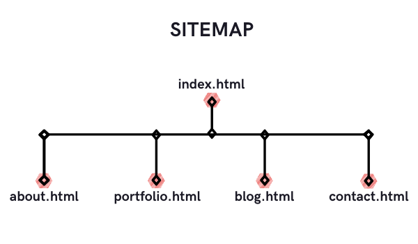
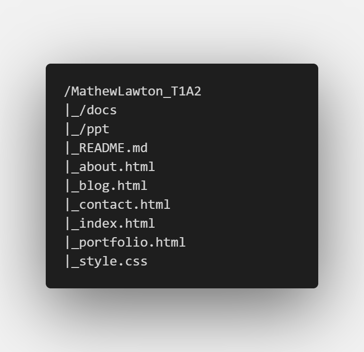
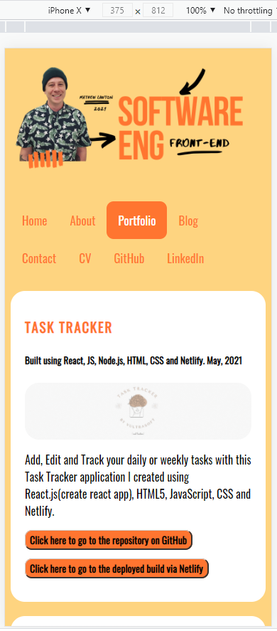
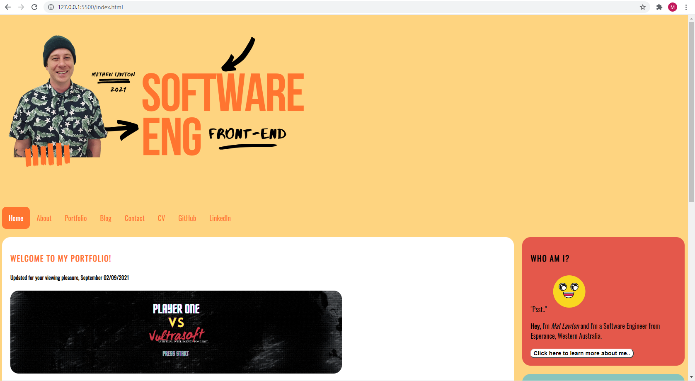
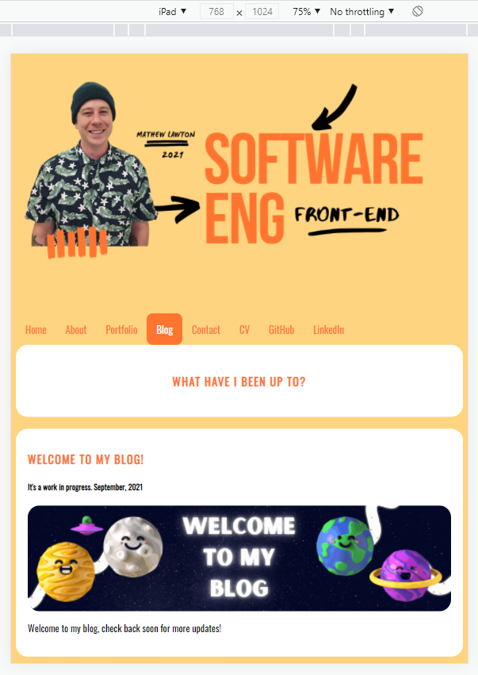
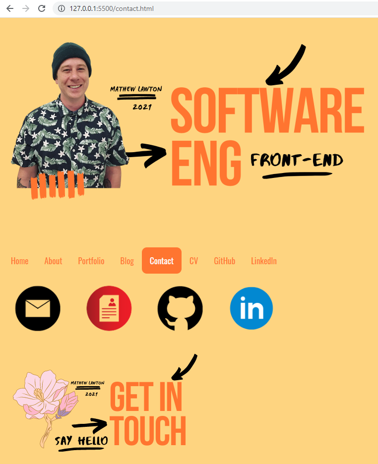
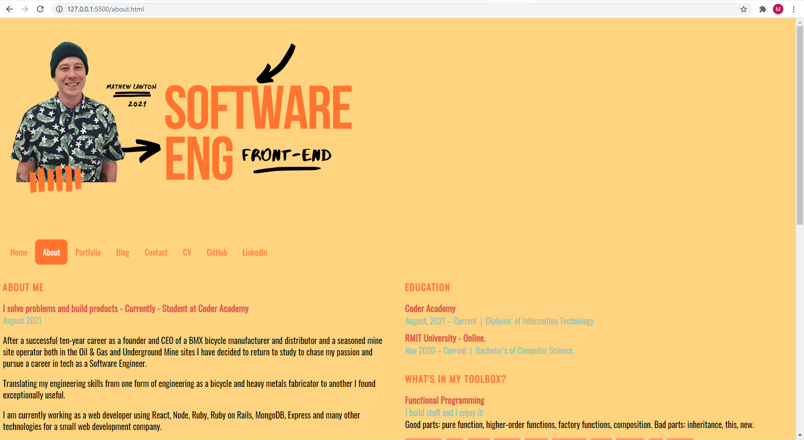

# :see_no_evil: Welcome to my portfolio

## Hey, Thanks for coming. Here's a link to my published portfolio website

<https://matlawton.github.io/coder-academy-t1a2/>

## Here's a link to my GitHub repository

<https://github.com/Matlawton/coder-academy-t1a2>

## Description

This is a portfolio project assignment for Coder Academy Term 1.
The online portfolio website is split up into five separate HTML pages; The Home page(index.HTML), which links to another page via the nav bar where you can see some information about me(about.html), some of my recent projects(portfolio.html), some of my blog posts on my blog page(blog.html), and finally we have a contact page(contact.html) where you can find links to my Resume, My LinkedIn and my GitHub and you can also use this page to send me an email.

## Purpose

The purpose of this website is to host a work in progress portfolio that may have an opportunity to communicate and demonstrate my skills and knowledge base to potential employers.

## Functionality / features

1. Simple, well defined navigation.
1. Easy-to-understand web design and clear user experience.
1. Junior graphic design visuals and descriptions.
1. Consistent Navigation bar.
1. Smooth animations with CSS on Hover function.

## Sitemap

/MathewLawton_T1A2
|_/docs
|_/ppt
|_README.md
|_about.html
|_blog.html
|_contact.html
|_index.html
|_portfolio.html
|_style.css

## Screenshots

## Target audience

The target audience for this project is a potential recruitment officer/agency or employer looking to engage with a developer and/or an IT professional.

## Tech stack (e.g. html, css, deployment platform, etc)

WSL Ubuntu-18.04 LTS
VS Code, used as my text editor.
HTML5
CSS, used to style my HTML.
Source control, GIT
GitHub, used to host my remote repository and deploy my project.
canva.com, used for graphic design works.

